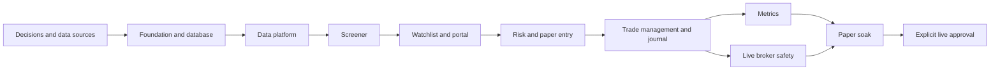

# Swing Trading System — Full Implementation Plan

**Status:** Proposed for review  
**Date:** 2026-07-19  
**Source specification:** [SWING-TRADING-SYSTEM-SPEC.md](SWING-TRADING-SYSTEM-SPEC.md)  
**Application:** Independent long-only NSE cash-equity swing system  
**Operating modes:** `PAPER` and `LIVE`

## 1. Purpose

This document defines how to build the complete swing-trading application while keeping its trading rules configuration-driven and replaceable. It covers:

1. Market data and the Nifty MidSmallcap 400 universe.
2. Daily Screener and evidence.
3. Versioned top-10 Watchlist.
4. One-minute Entry engine.
5. Position sizing and portfolio risk.
6. Paper and live CNC execution.
7. GTT protection, stop monitoring, and reconciliation.
8. Profit booking, trailing, and trade management.
9. Journal and audited operator controls.
10. Metrics, analysis, and charting.
11. Portal, API, alerts, security, deployment, and recovery.

The system will be built in stages. `LIVE` order submission will remain physically disabled until all live-safety gates in this plan pass.

## 2. Non-negotiable boundaries

- The Swing application remains independent from the Bollinger three-slot manager.
- It has separate configuration, process, port, logs, database, capital allocation, positions, schedules, alerts, and deployment lifecycle.
- Bollinger cleanup and retention jobs must never read or modify Swing state.
- The two applications may share a versioned Zerodha-session library or a read-only session boundary, but not trading state.
- The application defaults to `PAPER` after installation, restart, migration, configuration error, or missing live authorization.
- Changing a rule creates a new configuration version. Existing trades retain the rules and evidence active when they entered unless an explicitly audited operator action changes their management.
- Broker truth is authoritative for exposure, fills, orders, holdings, and GTT state; local truth remains authoritative for intended rules and audit history.
- No live position may be considered healthy without verified broker-side protection.
- No averaging down is permitted.
- A stop can only tighten.
- All entry, exit, and manual-control actions are idempotent and serialized by symbol.

## 3. Delivery strategy

Build the system as a modular monolith first:

- One Node.js/TypeScript process.
- Express REST API and web portal.
- SQLite in WAL mode.
- In-process schedules guarded by persistent job locks.
- Broker and data providers hidden behind interfaces.
- Paper and Kite adapters implementing the same contracts.

This is simpler to operate than microservices and sufficient for a 400-stock universe. Module boundaries must still allow later extraction of data ingestion or analytics without changing trading behavior.

## 4. Proposed project structure

```text
swing-trading/
├── package.json
├── package-lock.json
├── tsconfig.json
├── jest.config.js
├── ecosystem.config.js
├── .env.example
├── config/
│   ├── swing-config.schema.json
│   └── swing-config.example.json
├── src/
│   ├── index.ts
│   ├── app/
│   │   ├── createApp.ts
│   │   ├── ApplicationLifecycle.ts
│   │   └── HealthService.ts
│   ├── config/
│   │   ├── ConfigService.ts
│   │   ├── ConfigTypes.ts
│   │   └── defaults.ts
│   ├── auth/
│   │   ├── BrokerSessionProvider.ts
│   │   └── ZerodhaSessionBridge.ts
│   ├── broker/
│   │   ├── BrokerAdapter.ts
│   │   ├── KiteBrokerAdapter.ts
│   │   ├── PaperBrokerAdapter.ts
│   │   ├── BrokerTypes.ts
│   │   └── BrokerRateLimiter.ts
│   ├── data/
│   │   ├── InstrumentService.ts
│   │   ├── UniverseService.ts
│   │   ├── MomentumDatabaseAdapter.ts
│   │   ├── CorporateActionService.ts
│   │   ├── DailyCandleStore.ts
│   │   ├── IntradayCandleService.ts
│   │   ├── SectorDataService.ts
│   │   ├── ExchangeCalendar.ts
│   │   └── DataQualityService.ts
│   ├── screener/
│   │   ├── SwingScreener.ts
│   │   ├── StageTwoEvaluator.ts
│   │   ├── RelativeStrengthService.ts
│   │   ├── ImpulseDetector.ts
│   │   ├── AccumulationDetector.ts
│   │   ├── TighteningDetector.ts
│   │   ├── FinalTightAreaDetector.ts
│   │   ├── PivotService.ts
│   │   ├── SectorStrengthService.ts
│   │   ├── CandidateScorer.ts
│   │   └── ScreenerEvidence.ts
│   ├── watchlist/
│   │   ├── WatchlistService.ts
│   │   ├── WatchlistPublisher.ts
│   │   └── WatchlistTypes.ts
│   ├── trading/
│   │   ├── SwingPortfolioStrategy.ts
│   │   ├── EntryMonitor.ts
│   │   ├── EntryQualificationService.ts
│   │   ├── PositionSizer.ts
│   │   ├── PortfolioRiskService.ts
│   │   ├── OrderExecutionService.ts
│   │   ├── GttProtectionService.ts
│   │   ├── PositionManager.ts
│   │   ├── TradeManagementService.ts
│   │   ├── ReconciliationService.ts
│   │   ├── PositionStateMachine.ts
│   │   └── TradingTypes.ts
│   ├── journal/
│   │   ├── JournalService.ts
│   │   ├── OperatorActionService.ts
│   │   ├── MetricsService.ts
│   │   └── AnalysisService.ts
│   ├── persistence/
│   │   ├── Database.ts
│   │   ├── MigrationRunner.ts
│   │   ├── repositories/
│   │   └── migrations/
│   ├── scheduling/
│   │   ├── SchedulerService.ts
│   │   ├── PersistentJobLock.ts
│   │   └── TradingJobs.ts
│   ├── alerts/
│   │   ├── AlertService.ts
│   │   └── NotificationAdapter.ts
│   ├── api/
│   │   ├── routes/
│   │   ├── controllers/
│   │   ├── middleware/
│   │   └── dto/
│   ├── portal/
│   │   ├── templates/
│   │   ├── public/
│   │   └── charting/
│   └── utils/
│       ├── DecimalMath.ts
│       ├── Idempotency.ts
│       ├── Logger.ts
│       ├── Time.ts
│       └── Validation.ts
├── scripts/
│   ├── bootstrap-history.ts
│   ├── import-universe.ts
│   ├── data-quality-audit.ts
│   ├── replay-screener.ts
│   ├── replay-trades.ts
│   ├── reconcile-broker.ts
│   └── backup-database.ts
├── tests/
│   ├── unit/
│   ├── integration/
│   ├── replay/
│   ├── failure-injection/
│   └── fixtures/
├── data/                         # ignored runtime data
└── docs/
```

## 5. Technology choices

### 5.1 Base stack

- Node.js 18 or later.
- TypeScript strict mode.
- Express for API and portal.
- Jest and ts-jest for tests.
- Winston structured logging.
- KiteConnect for live broker operations.

### 5.2 New dependencies

Proposed dependencies must be pinned after compatibility validation:

- `better-sqlite3`: transactional local database and WAL mode.
- `zod`: environment, configuration, API, and operator-command validation.
- `decimal.js`: deterministic monetary, risk, and quantity calculations.
- `date-fns` and `date-fns-tz`: exchange-session and IST calculations.
- `helmet`: HTTP security headers.
- `express-rate-limit`: portal/API protection.
- `compression`: portal/API response compression.

Use a custom scheduler based on timers plus persistent locks unless cron-expression support materially simplifies operation. Avoid an ORM initially; use typed repositories and explicit SQL migrations.

## 6. Core interfaces

### 6.1 Broker adapter

Both adapters implement one contract:

```ts
interface BrokerAdapter {
  getProfile(): Promise<BrokerProfile>;
  getFunds(): Promise<BrokerFunds>;
  getQuotes(symbols: string[]): Promise<QuoteMap>;
  getHistoricalCandles(request: CandleRequest): Promise<Candle[]>;
  placeOrder(command: PlaceOrderCommand): Promise<BrokerOrderRef>;
  modifyOrder(command: ModifyOrderCommand): Promise<void>;
  cancelOrder(orderId: string): Promise<void>;
  getOrders(): Promise<BrokerOrder[]>;
  getTrades(): Promise<BrokerTrade[]>;
  getPositions(): Promise<BrokerPosition[]>;
  getHoldings(): Promise<BrokerHolding[]>;
  createGtt(command: CreateGttCommand): Promise<BrokerGttRef>;
  modifyGtt(command: ModifyGttCommand): Promise<void>;
  cancelGtt(gttId: string): Promise<void>;
  getGtts(): Promise<BrokerGtt[]>;
}
```

No strategy module imports KiteConnect directly.

### 6.2 Market-data provider

Separate market data from broker execution so a future licensed data source can replace Kite historical data:

```ts
interface MarketDataProvider {
  getDailyCandles(symbol: string, from: Date, to: Date): Promise<Candle[]>;
  getMinuteCandles(symbol: string, from: Date, to: Date): Promise<Candle[]>;
  getQuotes(symbols: string[]): Promise<QuoteMap>;
  getCorporateActions(symbol: string): Promise<CorporateAction[]>;
}
```

The local momentum database and Kite implementation both satisfy source-specific adapters behind this contract. Strategy and Screener modules must not query either source directly.

### 6.3 Clock and calendar

All strategy code receives an injected clock and exchange calendar. Tests must not depend on the machine clock.

## 7. Data requirements

### 7.1 Verified local momentum database

A reusable SQLite database exists at `swing-trading/data/momentum.db`. It was inspected in SQLite read-only mode on 2026-07-19; no rows or schema were modified.

Verified inventory:

| Asset                                   |                                       Coverage/rows | Latest data                         | Reuse                                                             |
| --------------------------------------- | --------------------------------------------------: | ----------------------------------- | ----------------------------------------------------------------- |
| `daily_prices`                          |        2,326,248 rows; 1,037 stocks; 3,867 sessions | 2026-07-06                          | Historical daily OHLCV bootstrap                                  |
| `stock_indicators`                      |                          2,068,855 rows; 996 stocks | 2026-07-06                          | Validation/reference; recompute strategy indicators independently |
| `stocks`                                | 9,028 unique NSE symbols; 9,022 active, 6 suspended | metadata updated through 2026-07-06 | Symbol, ISIN, status, and instrument-token bootstrap              |
| `index_prices`                          |                               3,841 `NIFTY500` rows | 2026-07-06                          | Broader-regime history only                                       |
| `index_prices_weekly` / `regime_weekly` |                                       814 rows each | July 2026                           | Research/reference only                                           |
| `market_cap_monthly`                    |                                         50,047 rows | historical snapshot                 | Market-cap and industry fallback subject to freshness checks      |
| `amfi_market_cap`                       |                                         30,854 rows | loaded Jan–Feb 2026                 | Market-cap category/rank fallback                                 |
| `symbol_changes` / `symbol_mappings`    |                                       46 / 100 rows | through 2026-07-06                  | Symbol lineage and migration checks                               |
| `trade_exclusions`                      |                                             30 rows | historical                          | Reference only; rules and freshness require review                |

Quality findings:

- SQLite `quick_check` returns `ok`.
- No duplicate `(stock_id, date)` groups exist in `daily_prices` or `stock_indicators`.
- Three daily OHLC rows violate basic price/range validation and must be quarantined.
- Data is stale relative to the current date and must be incrementally refreshed before any current scan.
- `index_membership` and `market_cap_snapshots` are empty.
- `stocks.sector` and `stocks.industry` are unpopulated for all rows.
- Only `NIFTY500` is present in `index_prices`; Nifty MidSmallcap 400 benchmark history is missing.
- A pre-existing orphaned `backtest_results` foreign-key reference must not be imported into the Swing operational database.

#### Reuse policy

- Open `momentum.db` with `mode=ro`; the Swing application must never migrate or write to it.
- Treat it as an external bootstrap/cache, not as the Swing journal or source of broker truth.
- Add `MomentumDatabaseAdapter` to map its `stocks`, `daily_prices`, symbol-lineage, market-cap, and optional indicator records into canonical typed models.
- Import only validated canonical records into the Swing-owned database with source ID, source row/checksum, import time, and quality state.
- Recompute all trading-critical indicators from canonical candles. Existing `stock_indicators` may be used to cross-check calculations but must not silently define the strategy.
- Never import user, credit, subscription, plan, or unrelated backtest tables.
- Detect source-schema changes at startup using a schema fingerprint and block import on incompatible changes.
- Preserve the original file untouched so the momentum application can continue to own it.

#### Refresh policy

1. Bootstrap historical stock candles and symbol metadata from `momentum.db`.
2. Use the active Kite session to fetch missing daily candles from 2026-07-07 onward and then incrementally after each completed session.
3. Use Kite instruments to reconcile current symbols, tokens, tick sizes, status, and tradability.
4. Obtain Nifty MidSmallcap 400 constituents, benchmark history, sectors, restrictions, and corporate actions from separately validated sources because the momentum database does not currently provide them.
5. Quarantine the three invalid OHLC rows and any later source disagreement until resolved.
6. Record per-symbol high-water marks so restarts request only missing sessions.

### 7.2 Data matrix

| Dataset                          | Required fields                                                |                                        Minimum history | Refresh                     | Primary candidate source                                  | Failure behavior                                                     |
| -------------------------------- | -------------------------------------------------------------- | -----------------------------------------------------: | --------------------------- | --------------------------------------------------------- | -------------------------------------------------------------------- |
| NSE instruments                  | token, symbol, exchange, segment, tick size, lot size          |                                                current | pre-open daily              | Kite instruments + momentum metadata                      | block affected symbols                                               |
| Nifty MidSmallcap 400 membership | symbol, effective date                                         |                        current plus history for replay | pre-open daily              | approved NSE/ licensed source                             | use last valid cache, alert; block publication if stale beyond limit |
| Daily OHLCV                      | date, adjusted O/H/L/C, volume                                 |                                  at least 320 sessions | post-close incremental      | momentum bootstrap + Kite incremental + adjustment source | reject symbol with gaps/errors                                       |
| One-minute candles               | timestamp, O/H/L/C, volume                                     | at least 20 comparable sessions for time-of-day volume | live plus incremental cache | Kite/provider                                             | skip boundary when incomplete/stale                                  |
| Benchmark candles                | date, O/H/L/C, volume                                          |                                  at least 250 sessions | post-close                  | validated provider                                        | block market gate and entries                                        |
| Sector mapping                   | symbol, sector, effective dates                                |                                   current plus history | weekly/pre-open changes     | approved source                                           | reject symbol without mapping                                        |
| Sector/index history             | date, O/H/L/C, breadth inputs                                  |                                  at least 250 sessions | post-close                  | approved source                                           | block sector gate when unavailable                                   |
| Corporate actions                | type, ex-date, ratio/amount, source                            |                                     full candle period | pre-open/post-close         | approved source                                           | quarantine impacted symbol                                           |
| Restrictions                     | surveillance, suspension, trade-to-trade, circuit/tradeability |                                                current | pre-open and before entry   | NSE/broker                                                | block affected symbol                                                |
| Exchange calendar                | sessions, holidays, special sessions                           |                               future year plus history | annual and event update     | NSE-approved calendar                                     | stop scheduling on uncertainty                                       |
| Fundamentals                     | earnings/sales fields and as-of date                           |                                               optional | provider schedule           | approved point-in-time source                             | display only in v1                                                   |
| Broker truth                     | orders, trades, positions, holdings, GTTs, funds               |                                                   live | startup/events/periodic     | active Kite session                                       | block entries when unhealthy                                         |

### 7.3 Data-source validation spike

Before implementing trading logic, run a time-boxed source-validation milestone:

1. Confirm the authoritative Nifty MidSmallcap 400 constituent source and redistribution/use terms.
2. Confirm whether selected daily candles are adjusted for splits, bonuses, mergers, and symbol changes.
3. Compare at least 20 symbols across two sources over corporate-action dates.
4. Validate the benchmark instrument/token and historical coverage.
5. Validate sector membership and sector-index availability.
6. Measure Kite historical and quote rate limits empirically within documented limits.
7. Verify minute-volume history sufficient for same-time-of-day relative volume.
8. Produce a signed data-source decision record.
9. Validate momentum-to-Kite symbol/token matching, including all `symbol_changes` and `symbol_mappings` records used by the selected universe.
10. Compare momentum and Kite daily OHLCV for at least 20 symbols, all three invalid rows, and known corporate-action dates.
11. Benchmark read-only bulk extraction and incremental imports without locking or altering `momentum.db`.

No Screener acceptance test may pass using silently unadjusted corporate-action discontinuities.

### 7.4 Data-quality rules

- Unique candle per symbol and exchange timestamp.
- Strictly increasing valid sessions.
- No weekend/holiday bars except declared special sessions.
- `low <= open, close <= high` and non-negative prices/volume.
- Detect duplicate, missing, zero-price, extreme-gap, and stale bars.
- Reconcile adjusted and broker-live price domains before calculating executable prices.
- Store source, ingestion time, adjustment version, quality state, and checksum.
- Quarantine a symbol rather than impute a trading signal from unsafe data.

## 8. Database and migrations

SQLite runs in WAL mode with foreign keys enabled. Migrations are append-only and applied transactionally.

### 8.1 Core table groups

#### Reference and market data

- `instruments`
- `universe_memberships`
- `sector_memberships`
- `exchange_sessions`
- `corporate_actions`
- `daily_candles`
- `minute_candles` or compressed minute-volume profiles
- `data_quality_events`

#### Configuration and scheduling

- `configuration_versions`
- `decision_records`
- `scheduled_job_runs`
- `persistent_locks`

#### Screener and Watchlist

- `scan_runs`
- `candidate_snapshots`
- `candidate_gate_results`
- `impulse_evidence`
- `accumulation_evidence`
- `tightening_evidence`
- `pivot_evidence`
- `candidate_scores`
- `watchlist_versions`
- `watchlist_entries`

#### Trading

- `positions`
- `position_state_events`
- `risk_snapshots`
- `orders`
- `order_events`
- `fills`
- `gtt_triggers`
- `gtt_events`
- `position_marks`
- `exit_signals`
- `reconciliation_runs`
- `reconciliation_items`

#### Journal, operations, and analytics

- `trade_journal_entries`
- `operator_actions`
- `alerts`
- `alert_acknowledgements`
- `daily_equity_snapshots`
- `metric_snapshots`
- `backtest_replay_runs`

### 8.2 Required database invariants

- A broker order ID and broker fill ID are unique.
- A position has one active lifecycle state.
- Remaining quantity equals confirmed buys minus confirmed sells.
- GTT protected quantity never exceeds remaining broker quantity.
- One entry command exists per symbol/setup/boundary idempotency key.
- One operator command executes once even after HTTP retry.
- State events and journal evidence are append-only.
- Destructive edits create correcting events; they do not rewrite history.
- Configuration version and setup evidence are retained on every position.

### 8.3 Backups

- Use SQLite online backup API or a WAL-safe checkpoint/backup mechanism.
- Create a daily encrypted backup after post-close processing.
- Retain daily backups for 30 days and weekly backups for 12 months initially.
- Verify backup checksums.
- Run a documented restore drill before live mode.

## 9. Configuration model

All configuration is schema validated and versioned. Categories:

- Application mode and live interlock.
- Universe and data-source settings.
- Price, liquidity, and restriction thresholds.
- Market and sector gates.
- Stage 2 and RS settings.
- Impulse, accumulation, tightening, clean-action, and pivot settings.
- Scoring weights and top-10 limit.
- Entry timing, relative volume, spread, anti-chase, and order limits.
- Stop buffer, reward/risk, position sizing, portfolio risk, and capital.
- Target, outside-day, 10-DMA, 20-DMA, and behavior-exit settings.
- Watchdog, GTT, reconciliation, and emergency policies.
- Alerts, retention, backup, portal, and security settings.

Every config update follows:

1. Validate syntax and cross-field invariants.
2. Show before/after diff and impacted open positions.
3. Require confirmation for risk/execution changes.
4. Store an immutable version and actor.
5. Apply to new setups by default.
6. Never silently alter an open position's management contract.

## 10. Zerodha authentication design

### 10.1 Initial implementation

Use one OAuth/session owner and a read-only Swing consumer:

- Bollinger remains the OAuth callback owner initially.
- Extract encryption/decryption and session-shape logic into a small versioned shared package, or expose it through a narrowly scoped `BrokerSessionProvider` interface.
- Swing reads the encrypted session through a configurable absolute path and validates it with `getProfile()`.
- Swing never overwrites or deletes Bollinger state.
- Session expiry blocks new Swing entries and alerts; existing broker GTT protection remains active.
- The currently authenticated Bollinger session can supply Swing data calls through this bridge. Swing must not generate a second Kite session because a new login may invalidate or race the token used by the production Bollinger process.
- Swing creates its own KiteConnect client instance but applies the shared active access token in memory; it never owns logout or session-file deletion.
- Heavy historical backfills run outside market hours. A shared API-budget coordinator or conservative cross-process rate budget must account for Bollinger and Swing using the same API key/session.

### 10.2 Later hardening

Move OAuth ownership to a shared repository-level auth package/service only after compatibility tests prove Bollinger behavior is unchanged. Do not make this extraction a prerequisite for paper-mode development.

## 11. Screener implementation

Implement Section 7.5 of the specification as pure, deterministic functions before service orchestration.

### 11.1 Pipeline

1. Validate data completeness and adjustments.
2. Apply Nifty MidSmallcap 400 membership, ₹20 price, liquidity, and restrictions.
3. Calculate market and sector context.
4. Calculate Stage 2 and 15-session rising RS line.
5. Detect a chronological 30% swing-low-to-impulse-high advance within 85 sessions.
6. Require two accumulation days and volume dominance of at least 1.5.
7. Detect 3–20-session orderly tightening with maximum 15% depth.
8. Detect clean action, thrust, setup type, and contraction sequence.
9. Detect 3–10-session final tight area with maximum 5% depth.
10. Calculate pivot, structural stop, 10-DMA distance, risk, $5R$ target ratio, and $2R$ chart room.
11. Score only mandatory-pass candidates.
12. Sort deterministically and publish top 10.

### 11.2 Algorithm implementation order

- Indicators and adjusted candle primitives.
- Stage 2 evaluator.
- RS line and cross-sectional percentile.
- Deterministic swing-point detection.
- Impulse enumeration and selection.
- Accumulation evidence.
- Tightening-window enumeration.
- Contraction segmentation and distribution absorption.
- Final-tight-area selection.
- Pivot, stop, and overhead-resistance detection.
- Candidate scoring and evidence serialization.

### 11.3 Screener outputs

For every universe symbol store:

- Pass/fail for every gate.
- Machine-readable rejection codes.
- Intermediate numerical evidence.
- Source/configuration versions.
- Chart annotations.
- Candidate score and rank.

The portal must show both passing candidates and searchable rejected candidates so logic can be tuned from evidence rather than anecdotes.

## 12. Watchlist implementation

### 12.1 Lifecycle

- Post-close Screener produces provisional version $N$.
- Pre-open data refresh produces final version $N+1$ when inputs change.
- At most 10 candidates are active.
- Market-gate-closed candidates remain visible but entry blocked.
- Every add, remove, reorder, expiry, manual exclusion, and conversion to position is journaled.
- Intraday replacement requires an explicit new Watchlist version.

### 12.2 Candidate states

- `PROVISIONAL`
- `ACTIVE`
- `ENTRY_BLOCKED_MARKET`
- `ENTRY_BLOCKED_SECTOR`
- `TRIGGER_ZONE`
- `ENTRY_PENDING`
- `CONVERTED_TO_POSITION`
- `EXPIRED`
- `INVALIDATED`
- `MANUALLY_EXCLUDED`

### 12.3 Portal behavior

Show rank, setup chart, seven gates, impulse, volume, tightening, pivot, stop, risk, target, chart room, current distance from pivot, market/sector block, and data warnings. Operators may exclude a candidate with a mandatory reason, but may not force an otherwise invalid candidate into live entry in v1.

## 13. One-minute Entry engine

### 13.1 Scheduling

- Start after normal market open and stop at configured new-entry cutoff, initially 14:30 IST.
- Evaluate only completed one-minute boundaries.
- Use a global boundary lock and symbol lock.
- Persist boundary decisions and idempotency keys.
- A missed boundary is logged and not reconstructed using future information.

### 13.2 Qualification

At each boundary:

1. Confirm mode, calendar, market gate, broader regime, and sector gate.
2. Confirm candidate version, freshness, and no existing exposure/order/GTT conflict.
3. Confirm quote and candle freshness.
4. Require pivot breakout, bullish candle, upper-half close, and same-time-of-day relative volume.
5. Apply spread, liquidity, gap, circuit, and anti-chase rules.
6. Recalculate structural risk from maximum fill price.
7. Recalculate $5R$, $2R$ chart room, cash, concentration, and aggregate risk.
8. Calculate quantity and tranche allocation.
9. Submit one idempotent marketable-limit order.
10. Persist the complete decision atomically before/with submission intent.

### 13.3 Order lifecycle

- `ENTRY_INTENT_CREATED`
- `ENTRY_SUBMITTED`
- `ENTRY_ACKNOWLEDGED`
- `ENTRY_PARTIALLY_FILLED`
- `ENTRY_FILLED`
- `ENTRY_CANCEL_PENDING`
- `ENTRY_CANCELLED`
- `ENTRY_REJECTED`
- `ENTRY_UNKNOWN_RECONCILE`

Unknown outcomes always reconcile before retrying. Never retry a timed-out broker request merely because no response was received.

## 14. Position sizing and portfolio risk

Quantity is the minimum imposed by:

- Risk budget.
- Available Swing capital/cash.
- Maximum one-stock allocation.
- Maximum sector allocation.
- Maximum aggregate open risk.
- Maximum positions.
- Liquidity participation.

Use decimal arithmetic and floor to whole shares. Store every limiting quantity and the final limiting reason.

Risk service responsibilities:

- Maintain Swing-only approved capital.
- Never count Bollinger capital or positions.
- Include pending and partially filled orders in reserved risk.
- Release capital only on confirmed cancellation/fill reconciliation.
- Reuse confirmed sale proceeds without increasing approved capital.
- Block all new entries on stale funds, reconciliation mismatch, or breached limit.

## 15. Paper broker

Paper mode must exercise the same strategy, journal, state machine, portal, GTT model, and reconciliation interfaces as live mode.

### 15.1 Fill model

Do not use always-at-limit optimistic fills. Support configurable simulation:

- Fill only when traded price crosses the limit.
- Apply spread and configurable slippage.
- Limit fill quantity using observed minute volume participation.
- Simulate partial fills and timeouts.
- Simulate gap-through-stop fills at the next available modeled price.
- Calculate delivery charges and taxes using versioned rules.

### 15.2 Fault injection

Paper adapter must support deterministic scenarios:

- Reject order.
- Delay acknowledgement.
- Partial fill.
- Duplicate event.
- Lost response with successful broker action.
- GTT creation failure.
- GTT status mismatch.
- Quote/data outage.

## 16. Live Kite execution

### 16.1 Safety interlocks

Live adapter activation requires all of:

- `mode = LIVE`.
- Explicit environment-level live enable flag.
- Valid configuration checksum approved for live.
- Valid Zerodha session.
- Healthy database and backup state.
- Clean startup reconciliation.
- No unacknowledged critical alert.
- Approved capital and per-trade limits.

### 16.2 Order policy

- NSE `CNC` only.
- Marketable LIMIT orders only by default.
- Broker tag/correlation ID where supported.
- Bound retry behavior by operation semantics.
- Poll orders/trades after placement; consume postbacks when available.
- Reconcile before acting on an unknown result.
- Handle freezes, circuits, auctions, settlement restrictions, and authorization failures explicitly.

## 17. GTT protection and stop watchdog

### 17.1 Protection sequence

After the first confirmed fill:

1. Lock symbol.
2. Calculate filled quantity and weighted-average price.
3. Create protection for filled quantity immediately.
4. Fetch GTT state and verify symbol, trigger, limit, side, product, and quantity.
5. Mark only verified quantity protected.
6. Resize protection as further partial fills arrive.
7. If protection cannot be verified within the approved deadline, block entries, raise critical alert, and follow the approved emergency-exit policy.

### 17.2 Monitoring

- One-minute quote cycle compares open positions with effective stops.
- Five-minute job verifies every GTT definition and status.
- Broker postbacks trigger immediate reconciliation.
- Startup and authentication restoration run full reconciliation before entry monitoring.

### 17.3 Exit race handling

All exits acquire the symbol lock and reconcile:

- Structural GTT.
- Watchdog emergency exit.
- Failed-breakout/no-progress exit.
- Profit target.
- Big outside-day partial.
- 10-DMA/20-DMA exit.
- Manual operator exit.

One winning exit intent owns the unreserved quantity. Other intents are cancelled/resized after fills.

## 18. Trade management

### 18.1 Initial failure

- Structural stop exits the complete remainder.
- Entry-day close below pivot creates a warning-candle low.
- Only the next valid day may trigger that warning-low exit.
- Five-session no-progress rule behaves as specified.
- A later setup is a new trade and risk calculation.

### 18.2 Profit partial

- Portal-configurable target constrained to 25%–30%.
- Sell half of then-open quantity.
- Confirm fill before reallocating cash or resizing GTTs.

### 18.3 Outside day

- Detect only from completed official daily bars.
- Queue half of quantity held at signal time.
- Execute at first valid next-session boundary under slippage policy.
- Serialize against all other exits.

### 18.4 Moving-average trail

For each 10-DMA or optional 20-DMA tranche:

1. Completed day $D$ closes below its moving average.
2. Store immutable day-$D$ low.
3. Monitor only next valid day $D+1$.
4. Exit if $D+1$ trades below signal low.
5. Expire signal after $D+1$ if not triggered.

Structural GTT stays active throughout.

## 19. Journal and operator controls

### 19.1 Journal functions

The portal supports:

- Candidate and setup evidence review.
- Trade timeline from scan through closure.
- Entry/exit charts and operator notes.
- Tags, thesis, mistakes, lessons, and attachments.
- Planned versus actual entry, stop, quantity, target, and risk.
- Broker order/fill/GTT timeline.
- MAE/MFE and rule-compliance review.
- First versus later setup sequence.

### 19.2 Editable controls

Permitted audited controls:

- Tighten stop.
- Change eligible trailing method for remaining quantity.
- Enable/disable optional conviction tranche where quantity permits.
- Reduce position.
- Exit full position.
- Exclude a Watchlist candidate.
- Add notes/tags.
- Acknowledge alerts.

Forbidden controls:

- Lower/loosen stop.
- Increase a losing position.
- Exceed approved capital/risk.
- Force entry through a failed mandatory gate.
- Delete broker events, state transitions, or audit history.

### 19.3 Command workflow

Every control command must:

1. Authenticate operator.
2. Validate role and CSRF protection.
3. Display current broker/local state and impact preview.
4. Require reason for risk-sensitive action.
5. Create idempotent command and audit record.
6. Acquire symbol lock.
7. Reconcile before execution.
8. Execute and verify broker result.
9. Record before/after state.
10. Alert on partial/unknown result.

## 20. Metrics and analysis

### 20.1 Core metrics

- Gross/net P&L and return.
- $R$ multiple and expectancy.
- Win rate, average win/loss, payoff ratio, profit factor.
- MAE, MFE, and MFE capture.
- Entry, exit, stop, and gap slippage.
- Holding period and time to target.
- Equity curve, high-water mark, drawdown, recovery time.
- Exposure, cash utilization, open risk, and sector concentration.
- Charges and taxes.

### 20.2 Attribution

Analyze by:

- Setup type.
- Screener score decile.
- Impulse magnitude/speed.
- Accumulation count and volume dominance.
- Tightening duration/depth.
- Final-tight-area depth and pivot distance.
- Structural risk band.
- RS percentile and sector rank.
- Market regime.
- Entry time and slippage.
- First versus second-or-later setup.
- Exit reason.
- Rule-compliant versus operator-modified trades.

### 20.3 Funnel metrics

Track:

- Universe → data-valid → Stage 2 → impulse pass → volume pass → tightening pass → final-tight pass → top 10 → trigger → submitted → filled → protected → profitable/closed.
- Rejection reason distribution.
- Candidate aging and missed-breakout outcomes.
- Paper-versus-modeled/live fill differences.

### 20.4 Correctness

- Metrics derive from immutable fills and marks, not editable summary fields.
- Daily snapshots are reproducible.
- Charges are versioned.
- Reports support lifetime, yearly, monthly, and rolling trade windows.

## 21. Portal and API

### 21.1 Portal pages

- Overview/health.
- Screener results and rejected candidates.
- Top-10 Watchlist.
- Candidate detail with annotated chart.
- Open positions and risk dashboard.
- Position detail and control panel.
- Orders, fills, GTTs, and reconciliation.
- Journal.
- Metrics and analysis.
- Alerts/incidents.
- Configuration and audit history.
- Data-quality status.

### 21.2 API groups

- `/api/health`
- `/api/auth/status`
- `/api/screener/runs`
- `/api/screener/candidates`
- `/api/watchlists`
- `/api/positions`
- `/api/orders`
- `/api/gtts`
- `/api/reconciliation`
- `/api/journal`
- `/api/metrics`
- `/api/alerts`
- `/api/config`
- `/api/operator-actions`

Mutation endpoints require authentication, CSRF protection, schema validation, idempotency key, audit reason where applicable, and concurrency/version checks.

## 22. Scheduling

Initial IST jobs:

- Post-close data finalization and Screener.
- Database backup after successful post-close processing.
- Pre-market instrument/universe/corporate-action/restriction refresh.
- Pre-open candidate recalculation and final Watchlist publication.
- One-minute Watchlist and stop monitoring during market hours.
- Five-minute GTT verification during market hours.
- Periodic broker reconciliation plus event-triggered reconciliation.
- New-entry cutoff at 14:30.
- Daily marks and trailing-signal generation after official close.

Every job stores start, heartbeat, completion, configuration version, output summary, and failure. Persistent lease locks prevent duplicate execution after restart.

## 23. Observability and alerts

### 23.1 Health domains

- Process and event-loop health.
- Database/WAL and backup health.
- Market-data freshness.
- Scheduler heartbeat.
- Zerodha authentication and API health.
- Reconciliation health.
- Protection coverage.
- Alert-delivery health.

### 23.2 Critical alerts

- Filled but unprotected quantity.
- Price through stop without valid exit state.
- Unknown broker exposure.
- Broker/local quantity mismatch.
- Missing or malformed GTT.
- Duplicate or unknown order result.
- Database write/backup failure.
- Stale benchmark or market data.
- Authentication failure.
- Risk-limit breach.

Alerts are deduplicated, persisted, severity classified, acknowledged, and escalated. Logging must redact access tokens, secrets, and sensitive broker payload fields.

## 24. Security

- Secrets only in ignored environment files or an approved secret store.
- Encrypted persisted Zerodha session.
- Never expose access tokens through logs or APIs.
- Portal authentication with secure session cookies.
- CSRF protection for mutations.
- Rate limiting and security headers.
- Role split between read-only and operator actions if remote access is enabled.
- Audit all login, config, and trading-control actions.
- Bind privately behind nginx/TLS; do not expose raw application port publicly.
- Validate file paths and uploads; limit journal attachment types and size.

## 25. Testing strategy

### 25.1 Unit tests

- Indicators, Stage 2, RS, impulse, accumulation, tightening, final tight area, pivot, stop, chart room, scoring.
- Quantity, risk, tranche rounding, and capital invariants.
- Position state machine and exit-signal expiry.
- Config cross-field validation.

### 25.2 Golden and replay tests

- Hand-labeled passing and rejected charts.
- Corporate-action cases.
- No-look-ahead chronological replay.
- Point-in-time universe and sector membership.
- Deterministic top-10 output.
- Full candidate-to-close trade replay.

### 25.3 Integration tests

- SQLite migrations and recovery.
- Paper broker end to end.
- Kite adapter contract with sanitized fixtures.
- Partial fill and GTT resize.
- Postback/polling races.
- Startup reconciliation.
- Portal control commands.

### 25.4 Failure injection

- Network loss before/after broker acceptance.
- Duplicate postback.
- Stale/missing candle.
- Database busy/full/corrupt simulation.
- Process termination during entry/protection/exit.
- Missing GTT and skipped trigger.
- Clock drift and missed scheduler boundary.

### 25.5 Required invariants

- No average down.
- Stop never loosens.
- No duplicate order from replay/retry.
- Remaining quantity reconciles exactly.
- Aggregate risk never exceeds limit.
- Entries never bypass mandatory gates.
- Filled live quantity obtains verified protection or enters emergency handling.
- `PAPER` can never invoke live order endpoints.

## 26. Deployment design

### 26.1 Process and routing

Proposed defaults, subject to deployment review:

- PM2 name: `trading-bot-swing`.
- Port: `3002`.
- Base path: `/tradebot-swing`.
- VM directory: `~/tradebot-swing`.
- Timezone: `Asia/Kolkata`.

Add an independent nginx route and health check. Do not alter Bollinger port 3001, route, process, or directory.

### 26.2 Deployment package

Include compiled code, package manifests, migrations, public assets, safe config template, and PM2 config. Exclude database, `.env`, logs, sessions, caches, and backups.

### 26.3 Atomic deployment

1. Back up database/config/session references.
2. Build and test locally/CI.
3. Upload to release directory.
4. Install production dependencies.
5. Validate config and run migration dry-run.
6. Stop Swing process only.
7. Checkpoint and back up SQLite.
8. Run migrations.
9. Swap release symlink/directory.
10. Start in `PAPER` unless live authorization explicitly remains valid for this release.
11. Run health, data, migration, and reconciliation checks.
12. Roll back code and database from matched backup on failure.

## 27. Phased implementation plan

### Phase 0 — Decision and data-source lock

**Deliverables**

- Decision register for all unresolved specification items.
- Data-source validation report.
- Confirmed universe, benchmark, sector, corporate-action, and historical-data sources.
- Approved configuration defaults and live-risk limits.
- Architecture decision records for SQLite, auth boundary, and portal stack.

**Acceptance gate**

- Required sources are legally/operationally usable.
- Corporate-action behavior is understood.
- No unresolved decision can change database identity or core order lifecycle.

### Phase 1 — Project foundation

**Deliverables**

- TypeScript project, lint/build/test scripts, configuration schema.
- Structured logger, clock/calendar, health endpoints.
- SQLite connection, migration runner, repositories, backup utility.
- Broker/data interfaces and paper stubs.
- CI task or repeatable validation commands.

**Acceptance gate**

- Clean build/tests.
- Config rejects unsafe or incomplete input.
- Migration and restore drill pass.
- Application starts only in `PAPER`.

### Phase 2 — Data platform

**Deliverables**

- Instrument and Nifty MidSmallcap 400 imports.
- Read-only `MomentumDatabaseAdapter`, schema fingerprint, high-water marks, and validated canonical import.
- Daily/minute candle ingestion and incremental cache.
- Benchmark, sector, calendar, restriction, and corporate-action ingestion.
- Data-quality engine and portal/API status.
- Historical bootstrap script.

**Acceptance gate**

- Required coverage for all eligible symbols.
- No unexplained duplicate/missing bars.
- Corporate-action fixtures pass.
- Momentum/Kite comparison and symbol-lineage fixtures pass; source database remains byte-for-byte unchanged.
- Stale/unsafe data blocks affected scans.

### Phase 3 — Screener

**Deliverables**

- All deterministic algorithms and evidence.
- Full gate pipeline, scoring, ranking, rejected-candidate store.
- Post-close scheduling.
- Annotated candidate charts.
- Replay and golden fixtures.

**Acceptance gate**

- Hand-labeled fixtures agree with expected outcomes.
- No-look-ahead tests pass.
- Same inputs/config produce identical top 10.
- Every rejection is explainable.

### Phase 4 — Watchlist and portal foundation

**Deliverables**

- Provisional/final Watchlist versions.
- Top-10 portal and candidate details.
- Pre-open refresh and version diff.
- Candidate state lifecycle and manual exclusion.
- Read-only health/data/config pages.

**Acceptance gate**

- Intraday list cannot mutate without a new version.
- Market/sector blocks are visible and enforced.
- All actions and versions are auditable.

### Phase 5 — Risk, Entry, and paper execution

**Deliverables**

- One-minute boundary monitor.
- Qualification, anti-chase, spread, volume, and reward/risk checks.
- Position sizing and capital reservations.
- Realistic paper broker and simulated GTTs.
- Entry state machine and idempotency.

**Acceptance gate**

- No duplicate entries under retry/restart.
- Paper fills/partials/rejects reconcile.
- All risk invariants pass property tests.
- No stale or incomplete one-minute candle can trigger entry.

### Phase 6 — Trade management and journal

**Deliverables**

- Structural stop, behavior exits, target partial, outside-day partial, 10-/20-DMA trail.
- Position lifecycle and exit-race ownership.
- Journal timeline, notes, tags, charts.
- Audited operator controls.
- Paper trade-management scenarios.

**Acceptance gate**

- Every exit path is idempotent.
- Stop cannot be loosened through API/UI/config.
- Quantity always reconciles.
- Manual commands show and store impact.

### Phase 7 — Metrics and analysis

**Deliverables**

- Trade, portfolio, funnel, and attribution metrics.
- Equity/drawdown charts and rolling reports.
- Setup-sequence and rule-compliance analysis.
- Exportable reports.

**Acceptance gate**

- Metrics reproduce from immutable fills.
- Hand-calculated fixtures match.
- Rebuild produces identical snapshots.

### Phase 8 — Live broker safety

**Deliverables**

- Read-only Zerodha session bridge.
- Kite broker adapter.
- GTT create/verify/resize/cancel.
- Postbacks, polling, watchdog, reconciliation, and emergency workflow.
- Live interlocks and critical alerts.

**Acceptance gate**

- Sanitized contract tests pass.
- Restart and lost-response drills pass.
- Filled-but-unprotected test invokes approved response.
- Startup mismatch blocks entries.
- Bollinger regression build/tests remain clean.

### Phase 9 — Paper soak and operational readiness

**Deliverables**

- Multi-week paper operation.
- Incident, auth, reconciliation, backup, restore, and deployment runbooks.
- Alert-channel verification.
- Performance and data-quality report.
- Defect closure report.

**Acceptance gate**

- Zero unresolved critical safety defects.
- No unexplained exposure or quantity mismatch.
- Scheduled jobs meet freshness targets.
- Restore and rollback drills pass.

### Phase 10 — Controlled live enablement

**Deliverables**

- Explicit approved live config and capital.
- Minimal initial position/trade limits.
- Human-observed initial trades.
- Post-trade safety review.

**Acceptance gate**

- User explicitly approves live enablement after reviewing paper evidence.
- Limits cannot rise automatically.
- Any critical protection/reconciliation defect returns system to entry-blocked state.

## 28. Dependencies and critical path



Parallel work after Phase 2:

- Portal shell can progress alongside Screener algorithms.
- Journal schema can progress alongside paper broker.
- Metrics queries can begin once immutable fills/state events are stable.
- Live adapter contract tests can begin against fixtures, but no live mutations before paper lifecycle acceptance.

## 29. What can be built immediately

- Project foundation and safe `PAPER` startup.
- Config schema framework.
- Database/migration framework.
- Broker/data interfaces.
- Data-quality engine skeleton.
- Read-only momentum schema adapter and historical bootstrap importer.
- Screener pure functions where thresholds are already approved.
- Watchlist/versioning model.
- Paper adapter framework.
- Journal/state-event foundation.
- Read-only portal shell.
- Test harness, injected clock, replay framework.

## 30. Decisions or validation still required

The following do not prevent foundation work but block final behavior acceptance:

1. Minimum median volume and final liquidity threshold.
2. Broader `CAUTION`/`RISK_OFF` rules.
3. Sector source, classification, and minimum score.
4. Swing-point and contraction-segmentation details.
5. Final leadership-breakout distinction from VCP.
6. Exact RS formula and comparison benchmark.
7. Opening-gap/gap-chase rules.
8. ATR fraction for structural stop buffer.
9. Final capital, per-trade risk, and concentration limits.
10. Default target within 25%–30%.
11. Standard/conviction tranche split.
12. Breakeven policy after partial.
13. Whether linear/parabolic classification remains analytics-only.
14. Any parabolic sell-into-strength rule.
15. Marketable-limit/slippage parameters.
16. Earnings/corporate-action/circuit handling.
17. Entry timeout and partial-fill policy.
18. Protection-failure emergency exit policy.
19. Event-calendar data source.
20. Notification channels/escalation.
21. Whether live entry is fully automatic or approval-gated.
22. Initial live capital/trade count.
23. Final clean-action scoring thresholds.
24. Authoritative adjusted OHLCV and point-in-time universe sources.
25. Delivery sell authorization/DDPI/CDSL operational readiness.
26. Ownership and refresh process for `momentum.db`; Swing will consume it read-only regardless of the owning process.

These decisions must live in a versioned decision register, not only in prose.

## 31. Definition of done

The entire application is considered implemented—not necessarily approved for live use—when:

- All modules and portal areas in this plan exist and are documented.
- Screener, Watchlist, paper Entry, trade management, Journal, and metrics work end to end.
- Every state and operator action is persisted and auditable.
- Replay, integration, invariant, and failure-injection suites pass.
- Data-quality failures produce safe blocks.
- Backup, restore, restart, reconciliation, and rollback drills pass.
- Live adapter and GTT workflows pass contract and controlled operational tests.
- Bollinger behavior, build, tests, deployment identity, and runtime state remain unchanged.
- The Swing process still defaults to `PAPER` and requires separate explicit approval to enable `LIVE`.

## 32. Recommended implementation sequence for review

Review and lock details in this order while foundation work proceeds:

1. Screener data sources and remaining thresholds.
2. Watchlist lifecycle and portal actions.
3. Entry, stop, trailing, and trade management.
4. Journal editing and operator controls.
5. Metrics and analysis.
6. Portfolio capital and risk.
7. Broker/GTT failure policies and authorization.
8. Alerts, deployment, backup, and live runbook.

Each reviewed section becomes a versioned specification amendment, configuration schema update, tests, and acceptance fixtures before implementation is marked complete.
